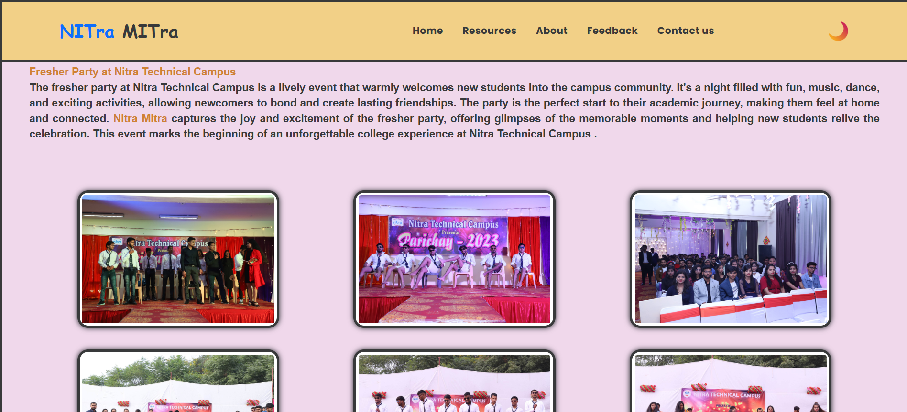
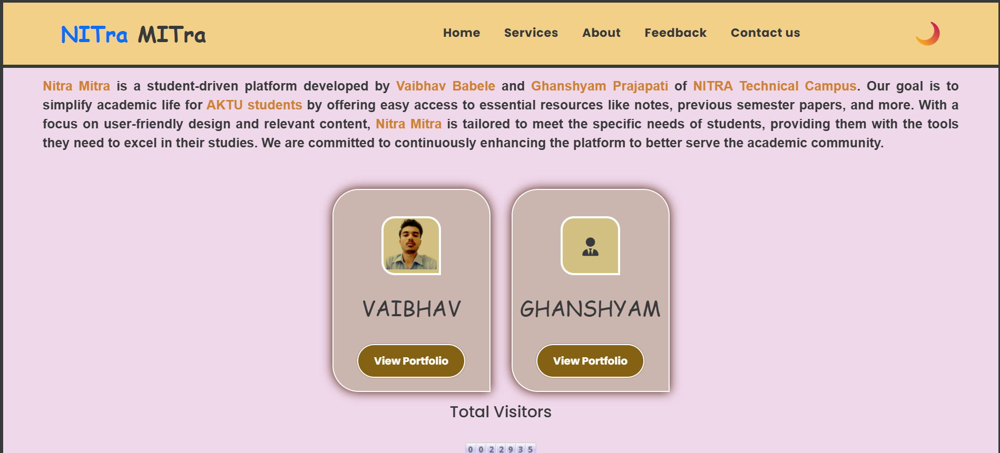

# 🚀 Nitra Mitra

> **Nitra Mitra** is an **open-source student initiative** from NITRA Technical Campus, Ghaziabad aimed at **simplifying academic and non-academic life** for students.  
From **syllabus tracking** to **AI-powered study tools**, and from **event management** to **career guidance**, everything resides under one open, collaborative platform.

</div>


**📊 Project Insights**
<table align="center">
    <thead align="center">
        <tr>
            <td><b>🌟 Stars</b></td>
            <td><b>🍴 Forks</b></td>
            <td><b>🐛 Issues</b></td>
            <td><b>🔔 Open PRs</b></td>
            <td><b>🔕 Closed PRs</b></td>
            <td><b>🛠️ Languages</b></td>
            <td><b>👥 Contributors</b></td>
        </tr>
     </thead>
    <tbody>
         <tr>
            <td></td>
            <td></td>
            <td></td>
            <td></td>
            <td></td>
            <td></td>
            <td></td>
        </tr>
    </tbody>
</table>

</div>


<h1 align="center">Supported By </h1>

</div>


## 📚 Table of Contents

- [About](#-about)
- [Features](#-features)
- [Screenshots](#-screenshots)
- [Tech Stack](#-tech-stack)
- [Getting Started](#-getting-started)
- [Project Structure](#-project-structure)
- [Contribution Guidelines](#-contribution-guidelines)
- [Contributors](#-contributors)
- [License](#-license)

<div align="center">
  
</div>

## 👨🏫 About

**Nitra Mitra** empowers students with:
- **Academic utilities** like syllabus tracking, attendance logs, and subject wikis  
- **AI-powered tools** for study assistance and summarization  
- **Community features** for college events, clubs, announcements, and a student marketplace  
- **Career growth resources** like job boards, skill trackers, and mock test modules  

It is **built by students, for students**, and welcomes open-source contributions from beginners to pros.

---

## 🌟 Features

### 📘 Academic Support
- 🧾 **Syllabus Tracker** – Upload & view syllabus (PHP, MySQL)
- 📈 **Attendance Monitor** – Manual & automated tracking (PHP, JS, MySQL)
- 📘 **Subject Wiki** – Community-curated subject pages (Markdown + PHP + MySQL)
- 🧪 **Lab Report Templates** – Submit & download lab formats (PDF, PHP, MySQL)

### 🏠 Non-Academic / PG Support
- 📌 **Notice Board** – College/PG announcements (PHP, MySQL, JS)
- 🛒 **Marketplace** – Buy/sell books & accessories (PHP, MySQL, Bootstrap)
- 🧹 **Service Rating** – Tiffin/laundry ratings (PHP, MySQL)
- 📦 **Lost & Found Portal** – Report and claim lost items (PHP, Bootstrap)

### 🧠 Technical & Project Help
- 🔍 **Open Source Opportunities** – GitHub API integration (PHP)
- 💻 **IDE Recommendation** – Suggest tools by project type (PHP, JS)
- 🧾 **Documentation Templates** – Quick README/LICENSE generator
- 🔐 **Version Control Tips** – Git tutorials & cheatsheets

### 🎉 Community & Events
- 📸 **Photo Gallery** – Event photo uploads (Cloudinary, PHP, JS)
- 🗣️ **Club Portal** – Manage/join clubs (PHP, MySQL, Bootstrap)
- 🏆 **Leaderboard** – Competition rankings (PHP, JS, MySQL)
- 📺 **Live Sessions** – Embedded YouTube/Zoom recordings

### 🤖 AI-Powered Features
- 🧠 **AI Study Assistant** – Q&A chat (Python, Flask, AI APIs)
- 📄 **AI Summary Tool** – Intelligent summarization
- 🔤 **Text Summarization** – Extract insights from notes
- 📁 **File Processing** – Read & summarize PDFs, TXT, MD
- ❓ **Question Generation** – Auto-generate practice questions
- ✨ **Notes Enhancement** – Smarter, extended note prep

### 🎓 Career & Growth
- 🧑💼 **Job Board** – Off-campus job postings
- 🎯 **Skill Tracker** – Track skill progress (PHP, Chart.js)
- 📈 **Mock Test Section** – MCQs with scoring
- 🗂️ **Career Resource Library** – Preparation docs & guides

### 🛠️ Utility & Enhancements
- 🌙 **Dark Mode** – Better nighttime UX
- 🌐 **Multi-language Support** – Localized UI
- 🧑🎓 **Student Dashboard** – Centralized hub
- 🔔 **Push Notifications** – OneSignal or JS polling

---

<h2 align="center">🎯 Open Source Programmes ⭐</h2>

<p align="center">
  <b>This project is now OFFICIALLY accepted for:</b>
</p>

  

🌟 **Exciting News...**

🚀 This project is now an official part of GirlScript Summer of Code – GSSoC 2025! 💃🎉💻 We’re thrilled to welcome contributors from all over India and beyond to collaborate, build, and grow with DevElevate. Let’s make learning and career development smarter – together! 🌟👨‍💻👩‍💻

👩‍💻 GSSoC is one of India’s **largest 3-month-long open-source programs** that encourages developers of all levels to contribute to real-world projects 🌍 while learning, collaborating, and growing together. 🌱

🌈 With **mentorship, community support**, and **collaborative coding**, it's the perfect platform for developers to:

✨ Improve their skills
🤝 Contribute to impactful projects
🏆 Get recognized for their work
📜 Receive certificates and swag!

🎉 **I can’t wait to welcome new contributors** from GSSoC 2025 to this DevElevate project family!
Let’s build, learn, and grow together — one commit at a time. 🔥👨‍💻👩‍💻


## 🖼 Screenshots

### 🏠 Home Page


### 📌 Our Services


### 📚 Resources


### 📝 Notes


### 🖼 Gallery


### 📢 Announcement


### 💬 User Experience


### 👥 Creator Page


### 🏆 PR Contributions
  
  
  


### 📜 Footer


---

## 🖥 Tech Stack

| **Frontend** | **Backend** | **Database** | **AI / ML** | **APIs** |
|--------------|-------------|--------------|-------------|----------|
| HTML, CSS, JS | PHP (Laravel), Python Flask | MySQL | Python, Flask, AI APIs | GitHub API, OpenAI API, OneSignal |

---

## 🛠 Getting Started

1. Fork the repository
2. Clone your fork
``` git clone https://github.com/<your-username>/nitra-mitra.git ```

3. Enter project folder
``` cd nitra-mitra ```

4. For PHP local setup (XAMPP/WAMP)
Move project to htdocs or www and visit:
http://localhost/nitra-mitra/

5. Add upstream for updates

```bash 
git remote add upstream https://github.com/<original-owner>/nitra-mitra.git
git fetch upstream
git rebase upstream/main
```

<div align="center">
  
</div>

## 📁 Project Structure 

```
├── .github/                      # GitHub workflows and automation
│   └── update-leaderboard.yml
├── backend/                      # Backend logic and integrations
├── docs/                         # Auto-generated contribution logs
├── favicon/                      # Favicon assets
├── games/                        # Game-related HTML/CSS/JS files
├── images/                       # Static images (e.g., logos, UI assets)
├── js/                           # JavaScript enhancements and features
├── node_modules/                 # Node dependencies
│
├── pages/                        # Main standalone HTML pages
│   ├── assistant.*               # AI Assistant UI (HTML/CSS/JS/ Setup instructions/Assistant usage guide)
│   ├── certificate.*             # Certificate  (HTML/CSS/JS)
│   ├── summary.*                 # summary  (HTML/CSS/JS)
│   ├── pr-contribution           # pr-contribution (HTML/CSS/JS)
│   ├── 404.html
│   ├── announcement-table.html
│   ├── cgpa-calculator.html
│   ├── contact.html
│   ├── cursor.css                   # Snake trail cursor 
│   ├── cursor.js                    # Snake trail cursor animation
│   ├── floating-button.*            # Floating button styles and logic
│   ├── floating-button.*            # Floating button styles and logic
│   ├── footer.css                   # Footer styling
│   ├── gateway.html
│   ├── infrastructure.html
│   ├── quantum.html
│   ├── resorces.html
│   ├── subject.html
│   ├── gallery.html
│   ├── paper.html
│   ├── paper.css
│   ├── privacy.html
│   ├── privacy.css
│   ├── terms.html
│   ├── team.css
│   ├── test.html
│   └── user-experience-table.html
│
├── .gitignore                    # Git ignore rules
├── .htaccess / .htaccess.backup # Server configuration files
├── CNAME                        # Custom domain setup
├── eslint.config.js             # ESLint configuration
├── index.html                     # Landing page 
├── index.css                      # Landing page 
├── index.js                       # Landing page 
├── LICENSE                      # Project license
├── README.md                    # Project overview and instructions
├── CONTRIBUTION.md              # Contribution guidelines
├── CODE_OF_CONDUCT.md           # Contributor behavior rules
├── DEPLOYMENT.md                # Deployment instructions
├── CONTACT_FORM_SETUP.md        # Contact form integration guide
├── SECURITY_IMPROVEMENTS.md     # Security enhancement documentation
├── PR_DESCRIPTION_FINAL.md      # Final PR description template
├── MERGED_PRS.md                # Auto-updated list of merged PRs
├── LEADERBOARD.md               # Auto-updated contributor leaderboard
├── package.json                 # Project metadata and scripts
└── package-lock.json            # Dependency lock file


```

<div align="center">
  
</div>

**⭐ Stargazers**

<div align="center">
  <a href="https://github.com/VAIBHAVBABELE/vaibhavbabele.github.io/stargazers">
    
  </a>
</div>

<div align="center">
  
</div>

**🍴 Forkers**

<div align="center">
  <a href="https://github.com/VAIBHAVBABELE/vaibhavbabele.github.io/network/members">
    
  </a>
<div align="center">
  
</div>

## 🤝 Contribution Guidelines
We welcome **frontend, backend, AI, and design** contributions.  
See [CONTRIBUTION.md](CONTRIBUTION.md) for details.

**🙌 👤 Contributors**

> Thank you once again to all our contributors who has contributed to Nitra Mitra! Your efforts are truly appreciated. 💖👏

<!-- Contributors badge (auto-updating) -->
[](https://github.com/VAIBHAVBABELE/vaibhavbabele.github.io/graphs/contributors)

<!-- Contributors avatars (auto-updating) -->
<p align="left">
  <a href="https://github.com/VAIBHAVBABELE/vaibhavbabele.github.io/graphs/contributors">
    
  </a>
</p>

See the full list of contributors and their contributions on the [`GitHub Contributors Graph`](https://github.com/VAIBHAVBABELE/vaibhavbabele.github.io/graphs/contributors).


## 📜 License
Licensed under the [MIT License](LICENSE).


## ⭐ Support

If you find this project helpful, please give it a star! ⭐

<div align="center">
  
</div>

### 👥 Project Admin & 👨‍🏫 Mentors – Nitra Mitra (GSSoC'25)**
| Role          | Name               | GitHub Profile                                      | LinkedIn Profile                                                        |
| ------------- | ------------------ | --------------------------------------------------- | ----------------------------------------------------------------------- |
| Project Admin | Vaibhav Babele    | [vaibhavbabele.github.io](https://github.com/VAIBHAVBABELE/vaibhavbabele.github.io)    | [vaibhavbabele](https://in.linkedin.com/in/vaibhavbabele)       |
| Mentor 1   | Anupriya yadav | [camren88](https://github.com/camren88)           | [anupriya-yadav](https://www.linkedin.com/in/anupriya-yadav-96845b274/)           |
| Mentor 2   | meet arora     | [meetarora10](https://github.com/meetarora10)     | [meet-arora](https://www.linkedin.com/in/meet-arora-603682296/)                   |
| Mentor 3   | Harsh Saini    | [Harshsaini001](https://github.com/Harshsaini001) | [harsh-saini](https://www.linkedin.com/in/harsh-saini-734ab6264/)                 |
| Mentor 4   | KIRUTHIGA C M  | [kiruthigacm](https://github.com/kiruthigacm)     | [kiruthiga-c-m](https://www.linkedin.com/in/kiruthiga-c-m-b34aa9328/)             |
| Mentor 5   | Shashank Gupta | [ShashankScript](https://github.com/ShashankScript)  | [shashank-gupta](https://www.linkedin.com/in/shashank-gupta-abb76030b)   |


<h2>Project Admin:</h2>
<table>
<tr>
<td align="center">
<a href="https://github.com/VAIBHAVBABELE/vaibhavbabele.github.io"></a><br><sub><b>VAIBHAV BABELE</b><br><a href="https://www.linkedin.com/in/vaibhavbabele/"></a></sub>
</td>
</tr>
</table>


<p align="center">

**Made with ❤️ by NITra MITra**

[Report Bug](https://github.com/VAIBHAVBABELE/vaibhavbabele.github.io/issues) • [Request Feature](https://github.com/VAIBHAVBABELE/vaibhavbabele.github.io/issues) • [Documentation](https://github.com/VAIBHAVBABELE/vaibhavbabele.github.io)

<p align="center">
  
</p>

> [🔝 Back to Top](#top)
